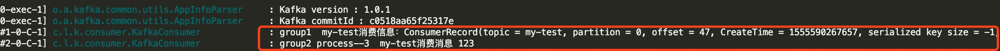

# kafka & springboot


## 一、使用docker单机搭建kafka集群

> 环境准备：docker环境，docker-compose工具

1. 创建一个自定义的文件夹，创建docker-compose.yml文件
```
version: '2'
services:
  zookeeper:
    image: wurstmeister/zookeeper
    ports:
      - "2181:2181"

  kafka:
    image: wurstmeister/kafka
    ports:
      - "9092"
    environment:
      KAFKA_ADVERTISED_HOST_NAME: 本机ip地址
      KAFKA_ZOOKEEPER_CONNECT: zookeeper:2181
      KAFKA_CREATE_TOPICS: test:1:1
    volumes:
      - /var/run/docker.sock:/var/run/docker.sock
```

2. 使用docker-compose命令启动3个节点
```
docker-compose up -d --scale kafka=3
```

3. 查看容器情况
```
docker ps
```


4. 测试

*注意：*
可使用docker的bash命令行，但应该使用
```
docker-compose exec kafka bash
```

```
生产者
./kafka-console-producer.sh --broker-list  172.27.0.5:9092 --topic my-test

消费者
./kafka-console-consumer.sh --bootstrap-server 172.27.0.5:9092 --topic my-test --from-beginning
```

## 二、springboot和kafka的整合

> 环境准备： spring boot开发环境

1. 引入依赖包
```
        <dependency>
            <groupId>org.springframework.kafka</groupId>
            <artifactId>spring-kafka</artifactId>
            <version>2.1.4.RELEASE</version>
        </dependency>
```

2. 创建kafka config类，通知springboot启用kafka
```
@Configuration
@EnableKafka
public class KafkaConfig {
}
```

3. application.properties中添加kafka的默认配置
```
#kafka
# 指定kafka 代理地址，可以多个
spring.kafka.bootstrap-servers=127.0.0.1:32771,127.0.0.1:32772,127.0.0.1:32773
# 指定默认消费者group id
spring.kafka.consumer.group-id=td
#监听配置
listeners=PLAINTEXT://127.0.0.1:32771,PLAINTEXT://127.0.0.1:32772,PLAINTEXT://127.0.0.1:32773

logging.level.root=info
```

4. 生产者生产消息
```
    @Autowired
    private KafkaTemplate kafkaTemplate;

    private final static String TOPIC = "my-test";

    kafkaTemplate.send(TOPIC, param);
```

5. 消费者消费消息
```
@Component
public class KafkaUtil {
    @KafkaListener(topics = "my-test")
    public void processMessage(String content) {
        System.out.println(content);
    }
}
```

## 三、kafka的多种处理方式

1. 同一个ConsumerGroup，同一个topic下的消息只被消费一次，即同一个ConsumerGroup下只能有一个consumer消费消息。
不同ConsumerGroup，消息都会被不同ConsumerGroup中的一个consumer消费


例子：
发送端按照一个指定topic发送消息：
```
    private final static String TOPIC_1 = "my-test";
    
    @RequestMapping(value = "/send", method = RequestMethod.POST,produces = {"application/json"})
    @ResponseBody
    public String sendKafka(@RequestBody String param) {
        kafkaTemplate.send(TOPIC_1, param);
        return param;
    }
```

消费者指定相应的consumerGroup和topic:
```
    @KafkaListener(groupId = "group1", topics = "my-test")
    public void processMessage(ConsumerRecord<?, ?> record) {
        log.info("group1  my-test消费信息：{}", record.toString());
    }

    @KafkaListener(groupId = "group2", topics = "my-test")
    public void processMessage2(String content) {
        log.info("group2 process--2  my-test消费消息：{}", content);
    }

    @KafkaListener(groupId = "group2", topics = "my-test")
    public void processMessage3(String content) {
        log.info("group2 process--3  my-test消费消息 {}", content);
    }

```
发送一个消息，结果如下：


* processMessage2方法和processMessage3同属于一个consumerGroup,只有一个consumer能消费
* processMessage方法和processMessage3分属于两个consumerGroup,两者均会消费消息
