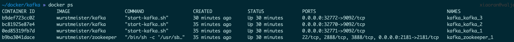

# kafka & springboot


## 使用docker单机搭建kafka集群

> 环境准备：docker环境，docker-compose工具

1. 创建一个自定义的文件夹，创建docker-compose.yml文件
```
version: '2'
services:
  zookeeper:
    image: wurstmeister/zookeeper
    ports:
      - "2181:2181"

  kafka:
    image: wurstmeister/kafka
    ports:
      - "9092"
    environment:
      KAFKA_ADVERTISED_HOST_NAME: 本机ip地址
      KAFKA_ZOOKEEPER_CONNECT: zookeeper:2181
      KAFKA_CREATE_TOPICS: test:1:1
    volumes:
      - /var/run/docker.sock:/var/run/docker.sock
```

2. 使用docker-compose命令启动3个节点
```
docker-compose up -d --scale kafka=3
```

3. 查看容器情况
```
docker ps
```



4. 测试

*注意：*
可使用docker的bash命令行，但应该使用
```
docker-compose exec kafka bash
```

```
生产者
./kafka-console-producer.sh --broker-list  172.27.0.5:9092 --topic my-test

消费者
./kafka-console-consumer.sh --bootstrap-server 172.27.0.5:9092 --topic my-test --from-beginning
```

## springboot和kafka的整合